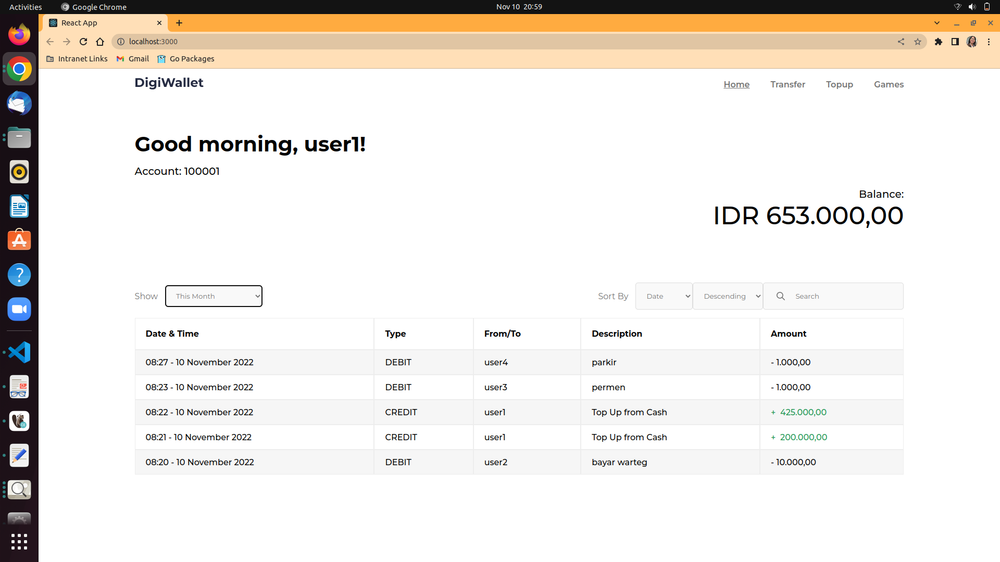
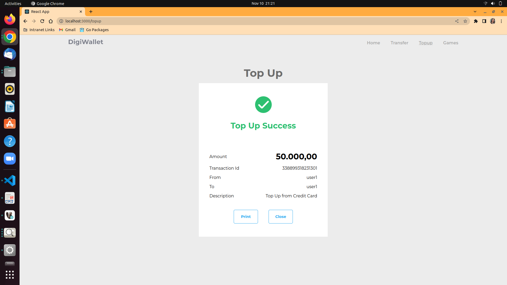

# Assignment React Website Application

## Project Description

This project is an assignment for Digitalent Batch 03 in learning React. The details of the project can be read in the specification provided by the trainers.

## How to Run

1. Edit `backend/.env` with your local database configuration. Below are the variables available in the `.env`

```
HOST=
PORT=
DB_USER=
DB_PASS=
DB_NAME=

ISSUER=
EXP_MIN=
SECRET_KEY=

```

2. Run the provided backend server with the following commands.

```
cd backend
./linux-server
```

3. Edit `.env` with the default user (because the specifications specify a hard-coded login) and server URL. Below are the variables available in the `.env`

```
REACT_APP_API_URL=
REACT_APP_DEFAULT_EMAIL=
REACT_APP_DEFAULT_PASSWORD=
```

4. Run the frontend app. Make sure you are in the root folder to run the following command.

```
npm run start
```

## App Screenshots

|        Description        |                      Screenshots                       |
| :-----------------------: | :----------------------------------------------------: |
|      Failed to Login      |            |
|      Initial Loading      |         |
| Default Transactions Page |    |
|   Searched Transactions   |   |
|     Last Year Filter      |   |
|     This Year Filter      |   |
|     Last Month Filter     |  |
|     This Month Filter     |  |
|   Default Transfer Page   |        |
|     Invalid Transfer      |        |
|      Failed Transfer      |         |
|    Successful Transfer    |      |
|    Default Top Up Page    |           |
|      Invalid Top Up       |           |
|     Successful Top Up     |        |
|     Default Game Page     |            |
|  Chance 2 Left Game Page  |            |
|  Chance 1 Left Game Page  |            |
|       Finished Game       |           |
|     Top Up from Game      |              |
|       Test Coverage       |                |

## Contributors

Frontend Developer:

- Tafia Alifianty Dinita Putri

Trainers:

- Jonathan Hendry Gunawan
- Thoriq Nur Faizal
- Andri Winata